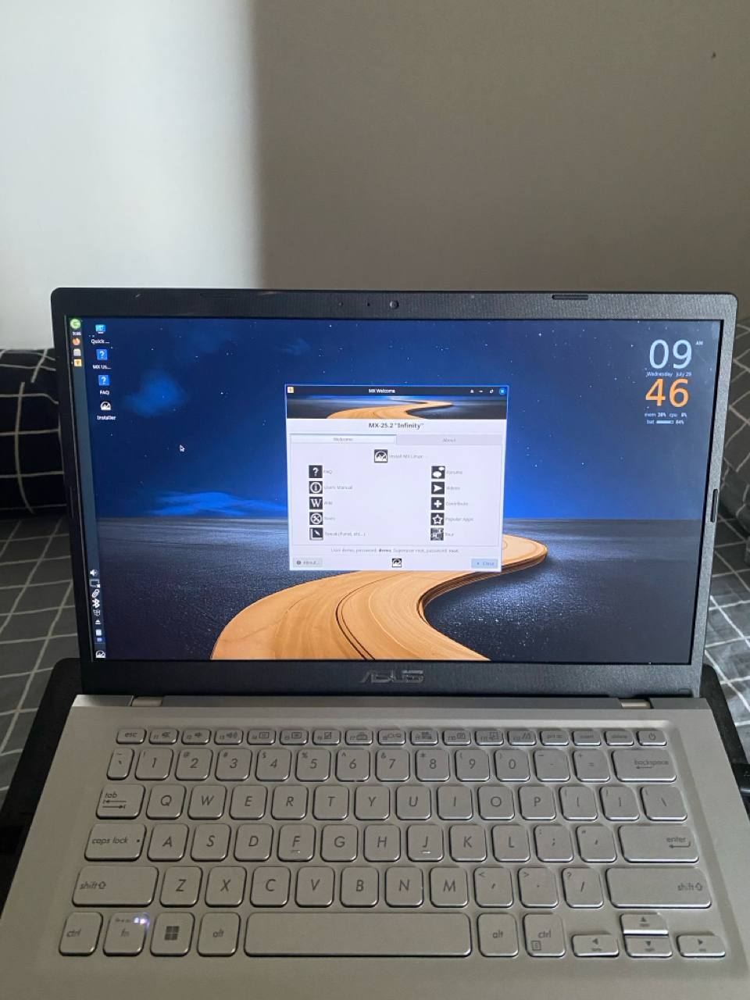
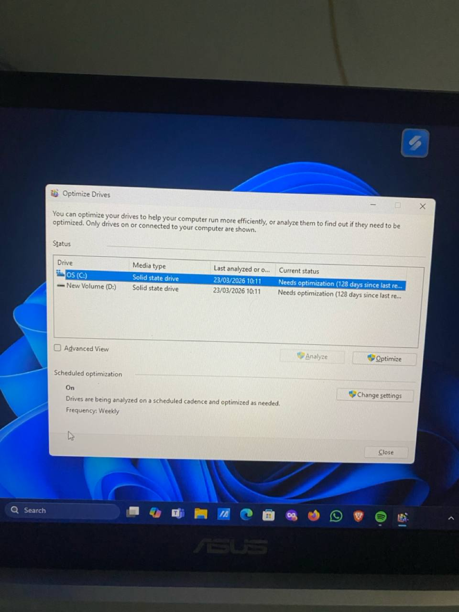

# 🐧 Linux 50K — Jasa Instalasi Linux Profesional

**Harga Tetap: Rp 50.000** · Garansi Bebas Virus & Performa Optimal
Pengembang / SysAdmin: **Theresa Pogon (akanra-dev)**

---

## 🇮🇩 Bahasa Indonesia

> Panduan Edukasi & Perbandingan Jasa Migrasi Linux.
> **Target Utama:** Warga, Sekolah, Yayasan, & Instansi se-Daratan Flores, NTT.

### 1. Perbandingan Biaya: Windows vs. Linux

| Komponen | Jalur Windows Konvensional | Jalur Linux Open-Source (Zorin / Mint / MX) |
| --- | --- | --- |
| **Lisensi OS** | Rp 2.500.000 – Rp 3.500.000 | Rp 0 (Gratis & Legal Seumur Hidup) |
| **Lisensi Office** | Rp 1.200.000 / tahun | Rp 0 (LibreOffice / OnlyOffice Built-in) |
| **Beban Antivirus** | Rp 300.000 / tahun (bikin lemot) | Rp 0 (Struktur Kernel Linux Aman Anti-Virus) |
| **Solusi Hardware Tua** | Dipaksa beli laptop baru (Rp 6–8 Juta) | Sulap Laptop Tua Jadi Ngebut (Rp 0) |
| **Total Investasi** | **> Rp 4.000.000 / Unit** | **Hanya Rp 50.000** (Jasa Instalasi & Edukasi) |

### 2. 5 Alasan Kuat Wajib Pindah ke Linux

1. **Bebas Lisensi Bajakan & Biaya Tersembunyi** — Seluruh sistem berbasis Open-Source murni. Bebas masalah hukum dan tidak ada pembaruan paksa yang merusak data.
2. **Performa Ultra-Cepat di Hardware Lama** — Menghentikan bloatware latar belakang. Booting super singkat dan penggunaan baterai lebih hemat.
3. **Kekebalan dari Virus Flashdisk** — Arsitektur izin POSIX Linux mencegah executable otomatis (.exe/.vbs) yang biasa merusak dokumen kerja warga di Windows.
4. **Antarmuka Mirip Windows & Mac** — Pilihan Zorin OS dan Linux Mint sangat intuitif. Tidak perlu belajar ulang dari nol; tombol Start, Taskbar, dan File Manager tetap di posisi yang sama.
5. **Hemat Anggaran untuk Pemulihan** — Uang jutaan rupiah yang harusnya dipakai beli lisensi software bisa dialokasikan penuh untuk kebutuhan utama keluarga & perbaikan infrastruktur.

### 3. Pembantahan Mitos-Mitos Linux

**Mitos 1:** *"Linux itu susah, harus pakai ketik-ketik hitam (Terminal) terus!"*
**Fakta:** Distro modern seperti Zorin OS & Linux Mint 100% menggunakan antarmuka grafis (GUI). Buka aplikasi, browsing, dan panggil file tinggal klik seperti biasa.

**Mitos 2:** *"File Microsoft Office (Word/Excel) tidak bisa dibuka di Linux!"*
**Fakta:** LibreOffice dan OnlyOffice yang terpasang otomatis kompatibel 100% membaca dan menyimpan format .docx, .xlsx, dan .pptx.

**Mitos 3:** *"Linux tidak bisa pakai Printer atau Wi-Fi!"*
**Fakta:** Linux modern memiliki dukungan driver bawaan yang sangat luas. Plug-and-play untuk mayoritas Wi-Fi, monitor, dan printer tanpa butuh CD driver installer.

### 4. Matriks Spesifikasi Hardware & Rekomendasi Distro

| RAM | Storage | Pilihan Distro | Karakter |
| --- | --- | --- | --- |
| **2 GB – 4 GB** | HDD / SSD Tua | **MX Linux (XFCE Edition)** | Sangat ringan, penggunaan RAM idle hanya ~600 MB, fokus pada kecepatan responsivitas hardware tua |
| **4 GB – 8 GB** | SSD (SATA/NVMe) | **Linux Mint (Cinnamon / MATE Edition)** | Sangat stabil, tampilan mirip Windows 7/10, ekosistem software sangat matang untuk kantoran & sekolah |
| **4 GB – 16 GB** | SSD modern | **Zorin OS (Core / Education)** | Visual modern sleek mirip Windows 11 / macOS, menyertakan amunisi aplikasi edukasi lengkap untuk siswa & kampus |

### 5. Benchmark Sebelum vs. Sesudah

| Parameter | Windows 10/11 (Kondisi Awal) | Linux Open-Source (Kondisi Akhir) |
| --- | --- | --- |
| **Waktu Booting** | 60–90+ Detik (Lambat) | 8–15 Detik (Sangat Cepat) |
| **Penggunaan RAM Idle** | 3.2 GB – 4.5 GB | 600 MB – 1.2 GB |
| **Suhu CPU & Kipas** | Panas & Kipas Berisik | Adem & Hening |
| **Ketahanan Keamanan** | *(data menyusul)* | *(data menyusul)* |

#### 📸 Dokumentasi Laptop Asus A416J Bapak

---

## 🇬🇧 English

> Educational Guide & Comparison of Linux Migration Services.
> **Main Target:** Residents, Schools, Foundations & Institutions across Flores Land, NTT.

### 1. Cost Comparison: Windows vs. Linux

| Component | Conventional Windows Path | Open-Source Linux Path (Zorin / Mint / MX) |
| --- | --- | --- |
| **OS License** | Rp 2,500,000 – Rp 3,500,000 | Rp 0 (Free & Legal for Life) |
| **Office License** | Rp 1,200,000 / year | Rp 0 (LibreOffice / OnlyOffice built-in) |
| **Antivirus Burden** | Rp 300,000 / year (makes it slow) | Rp 0 (Linux kernel structure is secure, virus-resistant) |
| **Old Hardware Solution** | Forced to buy a new laptop (Rp 6–8 Million) | Transform an Old Laptop to Be Fast (Rp 0) |
| **Total Investment** | **> Rp 4,000,000 / Unit** | **Only Rp 50,000** (Installation & Education Service) |

### 2. 5 Strong Reasons You Must Switch to Linux

1. **Free from Pirated Licenses & Hidden Costs** — The entire system is purely Open-Source. Free from legal issues and no forced updates that damage data.
2. **Ultra-Fast Performance on Old Hardware** — Stops background bloatware. Super-short boot time and more efficient battery usage.
3. **Immunity from Flash Drive Viruses** — Linux's POSIX permission architecture prevents automatic executables (.exe/.vbs) that commonly damage residents' work documents on Windows.
4. **Windows & Mac-like Interface** — The Zorin OS and Linux Mint options are very intuitive. No need to relearn from scratch; the Start button, Taskbar, and File Manager stay in the same place.
5. **Budget Savings for Recovery** — The millions of rupiah that would be spent on software licenses can be fully allocated to family needs & infrastructure repairs.

### 3. Debunking Linux Myths

**Myth 1:** *"Linux is hard, you have to keep typing in black text (Terminal)!"*
**Fact:** Modern distros like Zorin OS & Linux Mint are 100% graphical interface (GUI). Opening apps, browsing, and opening files is just clicking like usual.

**Myth 2:** *"Microsoft Office files (Word/Excel) can't be opened on Linux!"*
**Fact:** LibreOffice and OnlyOffice, installed automatically, are 100% compatible for reading and saving .docx, .xlsx, and .pptx formats.

**Myth 3:** *"Linux can't use Printers or Wi-Fi!"*
**Fact:** Modern Linux has very broad built-in driver support. Plug-and-play for the majority of Wi-Fi, monitors, and printers without needing an installer driver CD.

### 4. Hardware Specs & Distro Recommendations

| RAM | Storage | Distro Choice | Character |
| --- | --- | --- | --- |
| **2 GB – 4 GB** | Old HDD / SSD | **MX Linux (XFCE Edition)** | Very light, idle RAM usage only ~600 MB, focused on responsiveness on old hardware |
| **4 GB – 8 GB** | SSD (SATA/NVMe) | **Linux Mint (Cinnamon / MATE Edition)** | Very stable, Windows 7/10-like look, very mature software ecosystem for offices & schools |
| **4 GB – 16 GB** | Modern SSD | **Zorin OS (Core / Education)** | Modern sleek visuals like Windows 11 / macOS, includes a complete education app arsenal for students & campus |

### 5. Before vs. After Benchmark

| Parameter | Windows 10/11 (Initial Condition) | Linux Open-Source (Final Condition) |
| --- | --- | --- |
| **Boot Time** | 60–90+ Seconds (Slow) | 8–15 Seconds (Very Fast) |
| **Idle RAM Usage** | 3.2 GB – 4.5 GB | 600 MB – 1.2 GB |
| **CPU Temperature & Fan** | Hot & Noisy Fan | Cool & Silent |
| **Security Resilience** | *(data pending)* | *(data pending)* |

#### 📸 Documentation — Father's Laptop (ASUS A416J)

---

**📞 WhatsApp:** +62 813-3844-5874 · **💳 BNI:** 306308543 a/n Laurensia Theresa Pogon · **📄 Brochure PDF:** [service-portfolio.pdf](service-portfolio.pdf)